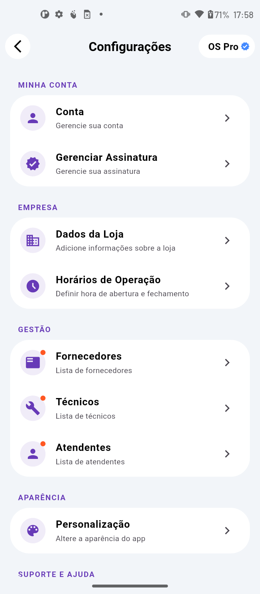
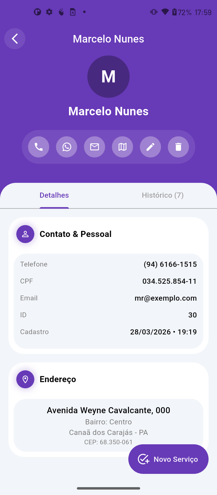
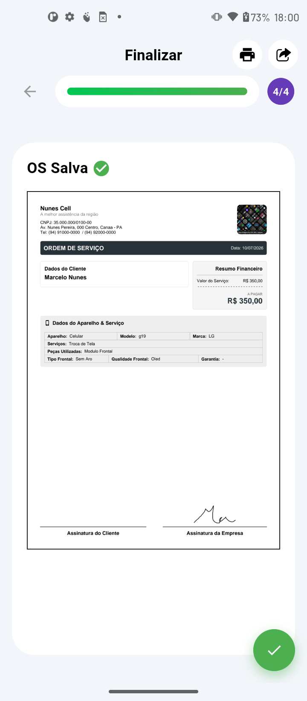
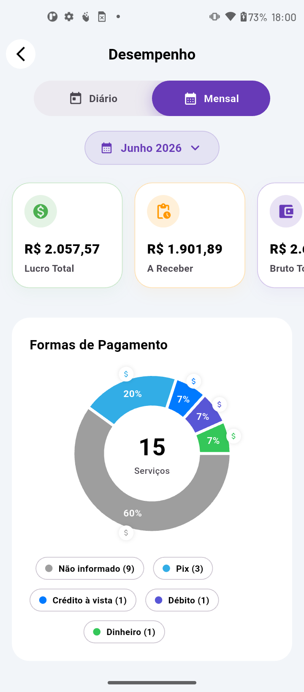
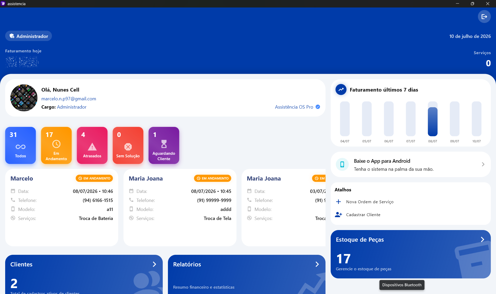
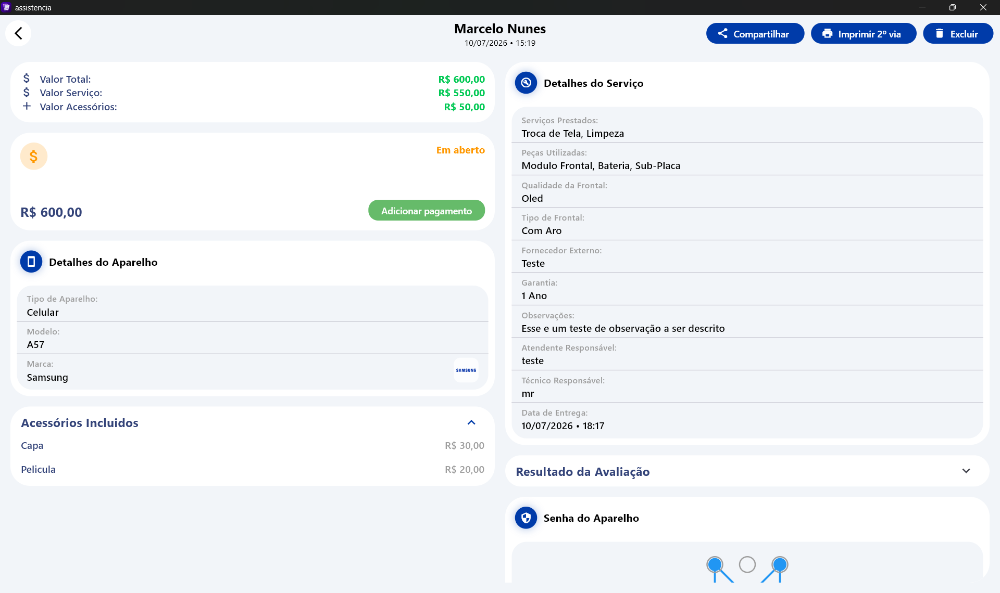
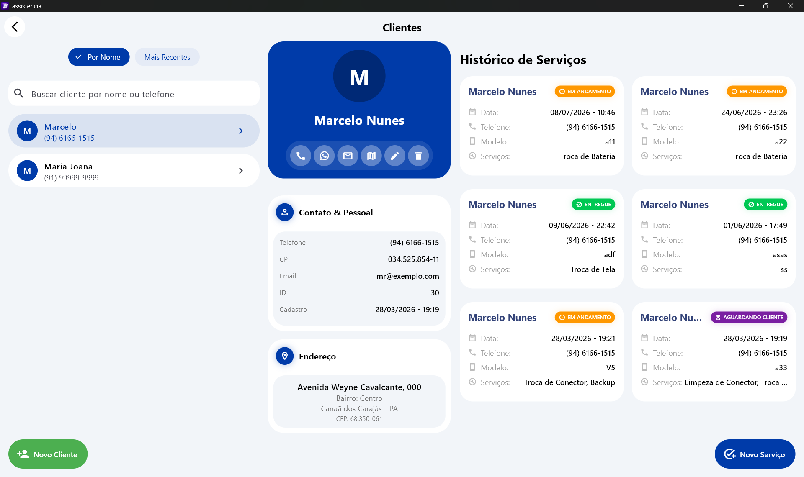
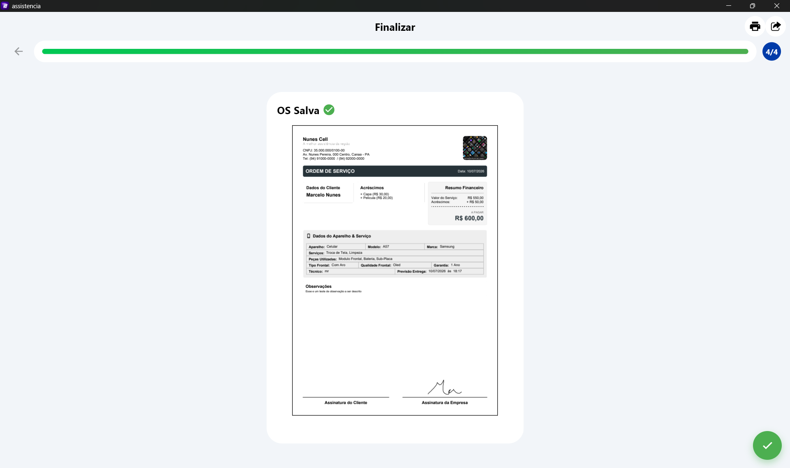
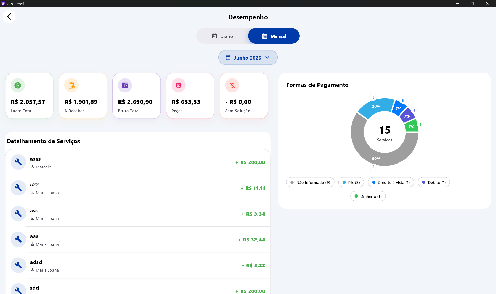

# Assistência OS

Sistema de gerenciamento para assistências técnicas desenvolvido em Flutter.

## 📱 Funcionalidades

- Cadastro de clientes
- Cadastro de técnicos
- Cadastro de atendentes
- Cadastro de fornecedores
- Cadastro de empresas
- Cadastro de serviços
- Geração de Ordens de Serviço (OS)
- Impressão e compartilhamento em PDF
- Assinatura digital
- Dashboard com indicadores
- Relatórios
- Controle de despesas e lucros
- Backup e sincronização
- Tema claro e escuro
- Material Design 3

## 🛠 Tecnologias

- Flutter
- Dart
- Firebase Authentication
- Cloud Firestore
- Firebase Storage
- Isar Database
- Provider

## 📷 Capturas de tela

| Mobile |
|-----------|-----------|
|  |  |  |  |  |  |

| Desktop |
|-----------|-----------|
|  |  |  |  |  |  |

## 🚀 Executando o projeto

```bash
flutter pub get
flutter run
```

## Desenvolvedor

Marcelo Nunes